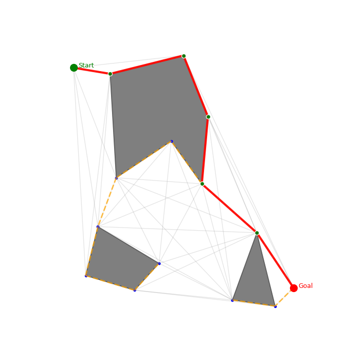

# Prática 2 — Grafos para Navegação  
Autores: Caio Oliveira e Matheus Pedro  

---

## Mapeamento dos Requisitos da Prática e Implementação

### Arquivos de Mapa: arquivo de texto e imagem (1 pt)

Arquivos presentes no diretorio `mapas` 

---

### Leitura do mapa e criação do grafo de visibilidade (2 pts)
**Funções:**  
- `Grafo.ler_mapa(caminho)` — realiza a leitura do arquivo de mapa.  
- `GrafoDeVisibilidade.gerar_grafo()` — gera os vértices e arestas a partir do mapa.  
---

### Implementação de Kruskal ou Prim (3 pts)
**Implementado:** `classe Prim`  
Utiliza **min-heap** e vetores `chave`, `pai` e `na_mst`.  
Retorna uma lista de arestas no formato `(pai, u)` representando a **Árvore Geradora Mínima (MST)**.

---

### Função verticeMaisProximo (1 pt)
**Implementado em:** `GrafoDeVisibilidade.verticeMaisProximo(ponto)`  
Retorna o vértice mais próximo de um ponto fornecido, incluindo sua coordenada e índice.

---

### Algoritmo de busca na árvore (1 pt)
**Implementado:** algoritmo **BFS (Busca em Largura)**.  
A partir da lista de arestas da MST e do número de vértices, o BFS reconstrói o caminho entre `start_v` e `goal_v`.

---

### Plotar o caminho no mapa (2 pts extras)
**Implementado em:** `Grafo.desenhar_mapa(...)`  
Gera uma visualização do grafo e destaca:  
- Arestas da MST **(Em laranja)** 
- Caminho final encontrado pelo BFS **(Em vermelho** 

---

### Instruções e README com prints (2 pts)
Este README contém as instruções completas de instalação e execução.  

---

## Instalação e Execução

Siga os passos abaixo para preparar o ambiente e executar o projeto.

### 1. Criar e ativar o ambiente virtual

Na raiz do repositório, crie o ambiente virtual e ative-o conforme seu sistema:

```powershell
python -m venv venv

# No PowerShell (Windows)
.\venv\Scripts\Activate.ps1

# No cmd.exe (Windows)
.\venv\Scripts\activate

# No Linux / macOS (bash / zsh)
source venv/bin/activate
```

Observação: no PowerShell pode ser necessário ajustar a política de execução uma única vez:

```powershell
Set-ExecutionPolicy -ExecutionPolicy RemoteSigned -Scope CurrentUser
```

### 2. Instalar dependências

Com o ambiente virtual ativo, instale as dependências listadas em `requirements.txt`:

```powershell
pip install -r requirements.txt
```

### 3. Executar o projeto

Com o ambiente virtual ativo, execute o script principal. A forma mais simples (a partir da raiz do repositório) é:

```powershell
python "Pratica 2\main.py"
```

Ou entre na pasta e execute:

```powershell
cd "Pratica 2"
python main.py
```

O script espera por padrão o arquivo de mapa em `Pratica 2/mapas/mapa.txt`. Se quiser usar outro arquivo, edite a variável `caminho_mapa` em `main.py`.

---

## Imagens de exemplo

Abaixo há duas imagens de exemplo que ajudam a entender a entrada e a saída do programa. 

- `mapas/mapa.png` — imagem ilustrativa do mapa de entrada.
- `mapas/caminho.png` — imagem com o caminho encontrado pelo algoritmo 



